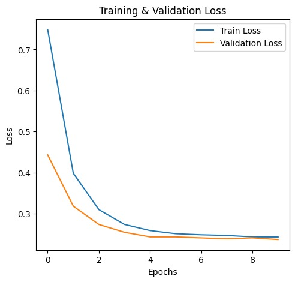
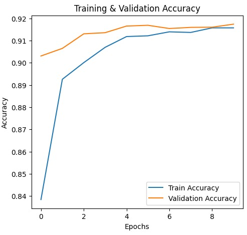

# Binary Classification Model

This project is a binary classification model built using TensorFlow and Keras. The model is trained on a dataset to predict binary outcomes (0 or 1). The training process, model architecture, evaluation metrics, and visualization of results are included.

## Model Architecture
The model consists of the following layers:
- **Input Layer**: Based on the number of features in `X_train`
- **Hidden Layer 1**: Dense layer with 64 neurons and ReLU activation
- **Hidden Layer 2**: Dense layer with 32 neurons and ReLU activation
- **Output Layer**: Dense layer with 1 neuron and Sigmoid activation for binary classification

## Training Details
- **Loss Function**: Binary Cross-Entropy
- **Optimizer**: Adam
- **Metrics**: Accuracy
- **Epochs**: 50
- **Batch Size**: 32

## Performance Metrics
The model achieved high accuracy on both training and validation sets. The key metrics are:

- **Training Accuracy**: ~92%
- **Validation Accuracy**: ~91%

### Loss & Accuracy Graphs

#### **Training & Validation Loss**


#### **Training & Validation Accuracy**


## How to Use This Model
### 1️⃣ Train the Model
```python
history = model.fit(X_train, y_train, epochs=50, batch_size=32, validation_data=(X_test, y_test))
```

### 2️⃣ Make Predictions on a New CSV File
```python
import pandas as pd
from sklearn.preprocessing import StandardScaler

# Load new data
new_data = pd.read_csv("new_data.csv")

# Apply same preprocessing as training
scaler = StandardScaler()
new_data_scaled = scaler.fit_transform(new_data)  

# Make predictions
y_pred_prob = model.predict(new_data_scaled)
y_pred = (y_pred_prob > 0.5).astype(int)

# Save predictions
new_data["Predicted"] = y_pred
new_data.to_csv("predicted_results.csv", index=False)
print("Predictions saved to 'predicted_results.csv'")
```

## Next Steps
- Improve model performance using additional hidden layers and dropout.
- Tune hyperparameters such as learning rate and batch size.
- Experiment with different activation functions.

## Author
Developed by **Vardaan Shukla** 🚀

